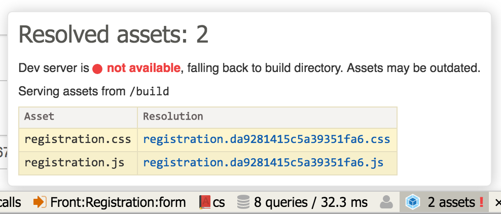

# Oops/WebpackNetteAdapter

[](https://travis-ci.org/o2ps/WebpackNetteAdapter)
[](https://codecov.io/gh/o2ps/WebpackNetteAdapter)
[](https://packagist.org/packages/oops/webpack-nette-adapter)
[](https://packagist.org/packages/oops/webpack-nette-adapter)

WebpackNetteAdapter is a tool that helps integrate your Nette Framework application with assets built via Webpack.


## Installation and requirements

```bash
$ composer require oops/webpack-nette-adapter
```

Oops/WebpackNetteAdapter requires PHP >= 7.2.


## Usage

Register the extension in your config file, and configure it. The two `build` options are mandatory:

```yaml
extensions:
    webpack: Oops\WebpackNetteAdapter\DI\WebpackExtension(%debugMode%, %consoleMode%)

webpack:
    build:
        directory: %wwwDir%/dist
        publicPath: dist/
```


Now you can use the `{webpack}` macro in your templates. It automatically expands the provided asset name to the full path as configured:

```html
<script src="{webpack app.js}"></script>
```


### webpack-dev-server integration

You might want to use the Webpack's [dev server](https://www.npmjs.com/package/webpack-dev-server) to facilitate the development of client-side assets. But maybe once you're done with the client-side, you would like to build the back-end without having to start up the dev server.

WebpackNetteAdapter effectively solves this problem: it automatically serves assets from the dev server if available (i.e. it responds within a specified timeout), and falls back to the build directory otherwise. All you have to do is configure the dev server URL. The dev server is enabled automatically in debug mode; you can override this setting via `enabled` option:

```yaml
webpack:
    devServer:
        enabled: %debugMode% # default
        url: http://localhost:3000
        timeout: 0.1 # (seconds) default
```

#### Ignored assets

You can also configure a set of asset names that should be ignored (i.e. resolved to an empty data URI) if the dev-server is available. This can be helpful e.g. if you use [`style-loader`](https://www.npmjs.com/package/style-loader) in development which does not emit any CSS files.

```yaml
webpack:
    devServer:
        ignoredAssets:
            - main.css
```

#### Public URL (e.g. Docker usage)

Dev-server might have different URLs for different access points. For example, when running in Docker Compose setup, the Nette application accesses it via the internal Docker network, while you access it in the browser via the exposed port. For this, you can set up a different `publicUrl`.   

```yaml
webpack:
    devServer:
        url: http://webpack-dev-server:3000 # URL over internal Docker network
        publicUrl: http://localhost:3030 # exposed port from the dev-server container
```


### Asset resolvers and manifest file

You might want to include the Webpack's asset hash in its file name for assets caching (and automatic cache busting in new releases) in the user agent. But how do you reference the asset files in your code if their names are dynamic?

WebpackNetteAdapter comes to the rescue. You can employ the [webpack-manifest-plugin](https://www.npmjs.com/package/webpack-manifest-plugin) or some similar plugin to produce a manifest file, and then configure the adapter to use it:

```yaml
webpack:
    manifest:
        name: manifest.json
```

This way, you can keep using the original asset names, and they get expanded automatically following the resolutions from the manifest file.

WebpackNetteAdapter automatically optimizes this in production environment by loading the manifest file in compile time.


### Debugger

In development environment, WebpackNetteAdapter registers its own debug bar panel into Tracy, giving you the overview of

- what assets have been resolved and how;
- the path from where the assets are served;
- whether the dev server is enabled and available.


